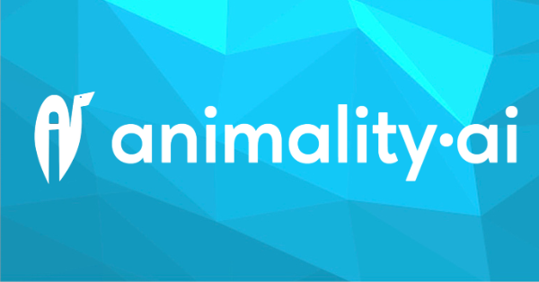

  
  <h1>ZenterMind — Companionship Call</h1>

## Overview

In a world where meaningful connections are more important than ever, **ZenterMind** offers a platform to create and nurture authentic companionship experiences. This project provides an implementation of an empathetic voice companion, using advanced emotion AI technology integrated with Next.js App Router for a seamless and intuitive application flow.

**ZenterMind** focuses on not just *what* you share, but *how* you connect. By analyzing vocal cues such as tone, pace, and emotion, it offers compassionate companionship to help you feel heard, understood, and less alone in your daily journey.

## Project deployment

Click the button below to deploy ZenterMind with Vercel:

Below are the steps to completing deployment:

1. Create a Git Repository for your project.
2. Provide the required environment variables. Contact [hello@zentermind.com](mailto:hello@zentermind.com) to obtain your API credentials.

## Support

For assistance or to engage with our community:

- **Email**: [hello@zentermind.com](mailto:hello@zentermind.com)
